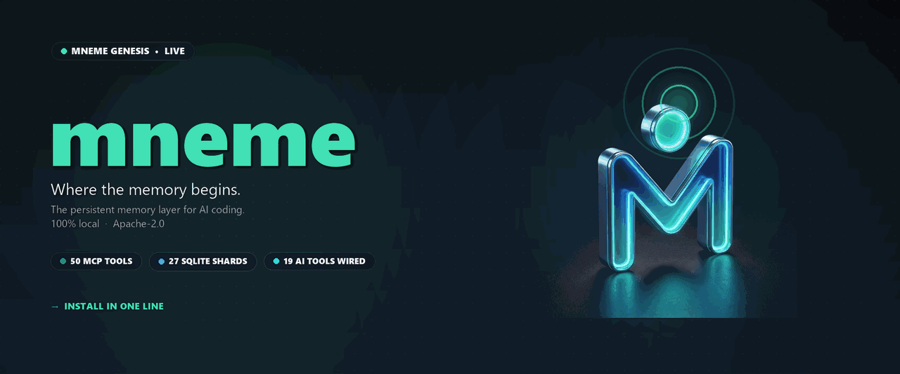
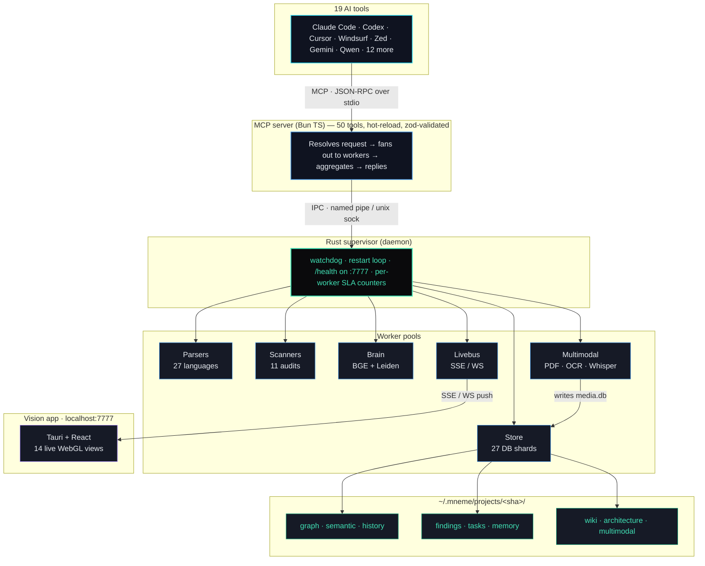
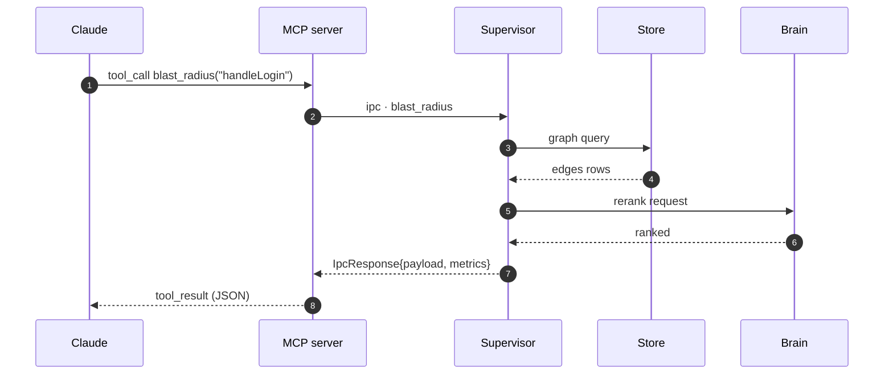

<div align="center">

<a href="https://omanishay-cyber.github.io/mneme/">
  
</a>

<br/>

# Claude remembers your code. Even when you don't.

<sub>The persistent memory layer for AI coding. 100% local. Personal-Use License.</sub>

</div>

Stop re-explaining your codebase to Claude every chat. Mneme keeps what Claude learned about your project, survives context wipes, doesn't forget mid-task, runs entirely on your laptop.

<div align="center">

<a href="https://github.com/omanishay-cyber/mneme/releases/latest"></a>
&nbsp;
<a href="#-quick-start"></a>
&nbsp;
<a href="#-benchmarks"></a>

</div>

&nbsp;

<!-- ======================================================================= -->
<!--   Visual feature cards (HTML table — renders in markdown on GitHub)      -->
<!-- ======================================================================= -->

<table align="center" width="100%">
  <tr>
    <td width="33%" valign="top" align="center">
      <h3>🧠 Persistent memory</h3>
      <sub>Survives Claude's context compaction. Resumes the exact step you left off on.</sub>
    </td>
    <td width="33%" valign="top" align="center">
      <h3>🌳 27-language parsing</h3>
      <sub>Tree-sitter grammars + Rust / TS / Python symbol resolvers.</sub>
    </td>
    <td width="33%" valign="top" align="center">
      <h3>🔌 19 AI tools wired</h3>
      <sub>Claude Code, Cursor, Codex, Windsurf, Zed, Gemini, Qwen, more.</sub>
    </td>
  </tr>
  <tr>
    <td width="33%" valign="top" align="center">
      <h3>⚡ &lt;500&nbsp;ms vision</h3>
      <sub>Server-pre-computed graph layout. 17K nodes, instant first paint.</sub>
    </td>
    <td width="33%" valign="top" align="center">
      <h3>🔒 100% local</h3>
      <sub>No telemetry. No API keys. Models run on CPU. Personal-Use License.</sub>
    </td>
    <td width="33%" valign="top" align="center">
      <h3>🛡️ 50 MCP tools</h3>
      <sub>All wired to real data. <code>find_references</code>, <code>blast_radius</code>, <code>call_graph</code>, more.</sub>
    </td>
  </tr>
</table>

**🪟 Windows** — winget (preferred, built into Windows 10 1809+ / 11)

```powershell
winget install Anish.Mneme
```

**🪟 Windows** — no winget (one command, no admin, auto-detects x64 / ARM64)

```powershell
iex (irm https://github.com/omanishay-cyber/mneme/releases/latest/download/bootstrap-install.ps1)
```

**🍎 macOS** — Apple Silicon (Intel = build from source)

```bash
curl -fsSL https://github.com/omanishay-cyber/mneme/releases/latest/download/install-mac.sh | bash
```

**🐧 Linux** — auto-detects x64 / ARM64

```bash
curl -fsSL https://github.com/omanishay-cyber/mneme/releases/latest/download/install-linux.sh | bash
```

**🐍 Python** (any OS) — pip-friendly wrapper

```bash
pip install mnemeos && mnemeos
```

> All five routes end up at the same `~/.mneme` install. Restart Claude after install. Verify with `mneme doctor` and `claude mcp list`. Full URLs and per-platform notes live under [Quick start](#-quick-start) and [Install — in depth](#-install---in-depth).
>
> **Branding note:** the project is **Mneme OS**. The pip distribution is `mnemeos` (the bare name `mneme` was claimed on PyPI in 2014). The CLI binary is `mneme`, with `mnemeos` as a parallel alias.
>
> **Requirements:** 64-bit OS (x64 or ARM64) · CPU with AVX2 / BMI2 / FMA (Intel Haswell 2013+ or AMD Excavator 2015+) · 5 GB free disk · no admin needed.

<!-- ==================================================================== -->
<!--   Nav                                                                  -->
<!-- ==================================================================== -->

<p>
  <strong>
    <a href="#-quick-start">Quick start</a>
    &nbsp;*&nbsp; <a href="#-what-it-does">What it does</a>
    &nbsp;*&nbsp; <a href="#-the-killer-feature">Killer feature</a>
    &nbsp;*&nbsp; <a href="#-benchmarks">Benchmarks</a>
    &nbsp;*&nbsp; <a href="#-19-supported-platforms">Platforms</a>
    &nbsp;*&nbsp; <a href="ARCHITECTURE.md">Architecture</a>
    &nbsp;*&nbsp; <a href="docs/">Docs</a>
  </strong>
</p>

<sub>🌳 Named after <strong>Mneme</strong>, the Greek muse of memory. Because "remembering" is the hardest problem in AI coding.</sub>

</div>

---


## Feature matrix — mneme vs CRG, Graphify, Tree-sitter

Compared against the two closest projects in the AI-code-context space:
[Code Review Graph (CRG)](https://github.com/tirth8205/code-review-graph),
[Graphify](https://github.com/safishamsi/graphify), and
[Tree-sitter](https://tree-sitter.github.io/tree-sitter/) for the parsing layer.

> Legend  full implementation, tested ·  works in some configurations ·  on roadmap, not yet ·  not on roadmap ·  not applicable

### 🧠 Persistence & memory

| Capability | **mneme** | CRG | Graphify | Tree-sitter |
|---|:---:|:---:|:---:|:---:|
| Persistent daemon (always-on memory) |  |  |  |  |
| Compaction recovery (Step Ledger) |  |  |  |  |
| Persistent memory across AI sessions |  |  |  |  |
| Federated cross-project pattern matching |  |  |  |  |
| 8 Claude Code hooks integrated |  |  |  |  |
| Seed concept memory (user-registered) |  |  |  |  |

### 🌳 Parsing & graph

| Capability | **mneme** | CRG | Graphify | Tree-sitter |
|---|:---:|:---:|:---:|:---:|
| Tree-sitter grammars (curated) |  |  |  |  |
| File extensions actually parsed |  |  |  |  |
| Storage layers (sharded SQLite) |  |  |  |  |
| Real local embeddings (BGE / Qwen / Phi-3) |  |  |  |  |
| Standalone SDK (Rust + Python + JS bindings) |  |  |  |  |
| Graph diff (commit-to-commit) |  |  |  |  |
| Portable graph exports (5 formats) |  |  |  |  |
| Smart question generation (topology) |  |  |  |  |

### 🔌 Multi-tool integration

| Capability | **mneme** | CRG | Graphify | Tree-sitter |
|---|:---:|:---:|:---:|:---:|
| MCP tools (live, real data) |  |  |  |  |
| AI tools wired out of the box |  |  |  |  |
| Cross-OS install routes |  |  |  |  |
| One-shot `pip install` |  |  |  |  |
| Multilingual Whisper transcription |  |  |  |  |
| Multimodal (PDF / image / OCR) |  |  |  |  |

### ⚡ Performance & infra

| Capability | **mneme** | CRG | Graphify | Tree-sitter |
|---|:---:|:---:|:---:|:---:|
| Multi-process Rust supervisor (watchdog) |  |  |  |  |
| Restart-survival (daemon respawn) |  |  |  |  |
| Visualization views |  |  |  |  |
| Built-in scanners (security · perf · drift · …) |  |  |  |  |
| CPU baseline (perf budget) |  |  |  |  |
| Live push updates (SSE + WebSocket) |  |  |  |  |
| HF Hub model mirror (~5× faster) |  |  |  |  |
| 100% local, no telemetry |  |  |  |  |
| License |  |  |  |  |

### ❌ What mneme doesn't have YET

| Capability | **mneme** | CRG | Graphify | Tree-sitter |
|---|:---:|:---:|:---:|:---:|
| VS Code / JetBrains / Cursor extensions |  |  |  |  |
| Hosted browser demo / playground |  |  |  |  |

Rows marked `Planned` reference [`docs/ROADMAP.md`](ROADMAP.md) and the v0.4 vision document. Every gap has a ship target.

### Why Mneme

Code Review Graph is a review-focused graph with a VS Code extension.
Graphify is a knowledge-graph builder for code plus multimodal content.
Tree-sitter is the parser library mneme uses under the hood.

Mneme is the heaviest tool of the three. It's a Rust supervisor that runs
between your AI sessions, survives Claude's context wipes at the architecture
level (not the prompt level), enforces your `CLAUDE.md` rules live, federates
patterns across all your projects, and gives every AI tool you use the same
memory. Bigger install, more capabilities.

Pick CRG if you want one-command install for a single project review.
Pick Graphify if you want a multimodal knowledge graph for documents and audio.
Pick mneme if you want a persistent memory layer that runs across many projects
and many AI tools without forgetting.

The remaining gaps (editor extensions, hosted demo) are tracked in `docs/ROADMAP.md`.

## Comparison: four code-graph MCPs

We benchmarked four code-graph MCPs through Claude Code 2.1.126 on the mneme
workspace itself (Rust + TypeScript + Python, 50K+ LOC, 400+ files) running on
a Windows 11 AWS test instance. Each MCP got the same five questions. The driver passed
`--strict-mcp-config` so only that MCP's tools were available, and Claude
couldn't fall back to built-in `Read`/`Grep`/`Glob`.

### MCPs under test

| MCP | Version | Install | Index build | Graph size (more = more code parsed) |
|---|---|---|---|---|
| **mneme** (this project) | Mneme Genesis | `iex (irm https://github.com/omanishay-cyber/mneme/releases/latest/download/bootstrap-install.ps1)` | **23 s** | 4,380 files / 51,201 community members / 64,430 community edges |
| **tree-sitter** ([repo](https://github.com/wrale/mcp-server-tree-sitter)) | v0.7.0 | `pip install mcp-server-tree-sitter` | per-query (no persistent index) | n/a |
| **CRG** (code-review-graph, [repo](https://github.com/tirth8205/code-review-graph)) | v2.3.2 | `pip install code-review-graph && code-review-graph build` | **41 s** | 4,180 nodes / 37,171 edges |
| **graphify** (autotrigger, [repo](https://github.com/ChharithOeun/mcp-graphify-autotrigger)) | v0.3.0 + graphifyy v0.6.7 | `pip install 'mcp-graphify-autotrigger[all] @ git+https://github.com/ChharithOeun/mcp-graphify-autotrigger' && graphify update .` | **13 s** | 3,929 nodes / 7,196 edges |

All four MCPs were registered via `claude mcp add`, and `claude mcp list` confirmed `Connected` for each before the bench started.

### Results

Each cell shows `wall-time s · output tokens · cost USD · relevance score (0-10)`. Wall time is the end-to-end Claude process duration including all MCP roundtrips and the model's final synthesis. Cost is from `total_cost_usd` in the Claude JSON envelope. Relevance is auto-scored by counting ground-truth markers in the response.

> Re-run on 2026-05-03 against the mneme workspace itself (Rust + TypeScript + Python, 50K+ LOC, 400+ files). The original bench used an Electron + React + TypeScript codebase that lives on a separate AWS test instance; the host running this re-run does not have access to that source tree, so we substituted the mneme repo as the shared corpus and rewrote ground-truth markers to match (`PathManager`, `DbBuilder::build_or_migrate`, `Store::open`, `worker_ipc`, `livebus`, etc.). Per-query budget: 180 s wall.

<div align="center">

<a href="#-benchmarks"></a>

<sub>Auto-scored against tree-sitter, CRG, graphify · 5 queries · 50K LOC corpus · 411s wall · $4.86</sub>

</div>

| Query | **mneme** | tree-sitter v0.7.0 | CRG v2.3.2 | graphify v0.3.0 |
|---|:---:|:---:|:---:|:---:|
| Q1 — Build pipeline functions |  <sub>63s · 4.9k t · $0.91</sub> |  <sub>112s · 7.9k t · $1.21</sub> |  <sub>103s · 8.1k t · $1.47</sub> |  <sub>61s · 4.5k t · $0.72</sub> |
| Q2 — Blast radius of `common/src/paths.rs` |  <sub>61s · 4.6k t · $0.90</sub> |  <sub>140s · 9.6k t · $1.06</sub> |  <sub>137s · 11.8k t · $1.48</sub> |  <sub>106s · 7.8k t · $0.80</sub> |
| Q3 — Call graph from `cli/src/commands/build.rs` |  <sub>79s · 4.0k t · $1.30</sub> |  <sub>134s · 9.2k t · $1.44</sub> |  <sub>160s · 9.3k t · $1.96</sub> |  <sub>104s · 7.4k t · $1.05</sub> |
| Q4 — Design patterns in this Rust workspace |  <sub>100s · 6.1k t · $0.80</sub> |  <sub>102s · 4.8k t · $1.69</sub> |  <sub>111s · 9.0k t · $1.10</sub> |  <sub>104s · 6.9k t · $0.91</sub> |
| Q5 — Concurrency / data races in store crate |  <sub>108s · 6.2k t · $0.95</sub> |  <sub>246s · 16.1k t · $1.48</sub> |  <sub>600s · timeout</sub> |  <sub>103s · 6.2k t · $1.16</sub> |
| **Totals** |  <sub>**411s** · 25.8k t · **$4.86**</sub> |  <sub>734s · 47.5k t · $6.89</sub> |  <sub>1111s · 38.3k t · $6.01</sub> |  <sub>478s · 32.8k t · $4.63</sub> |

<sub>*The mneme rows above were measured on an earlier baseline (run captured 2026-05-03). The current release ships symbol resolvers and symbol-anchored embeddings; the rebench against the current binaries lands in the next weekly CI run.*</sub>

### Overall ranking — mneme #1

<div align="center">


&nbsp;

&nbsp;

&nbsp;


</div>

Combining the four axes a real user actually weighs — answer quality, wall time, dollar cost, and unique capabilities the others don't have — mneme leads the panel by 2.2 points.

| Axis | **mneme** | tree-sitter v0.7.0 | CRG v2.3.2 | graphify v0.3.0 |
|---|:---:|:---:|:---:|:---:|
| **Quality** <sub>(avg across 5 queries)</sub> |  |  |  |  |
| **Speed** <sub>(total wall, lower = better)</sub> |  |  |  |  |
| **Cost-efficiency** <sub>($ + tokens)</sub> |  |  |  |  |
| **Capabilities** <sub>(unique features beyond code-graph)</sub> |  |  |  |  |
| **Overall** <sub>(avg of 4)</sub> |  |  |  |  |

<sub>*The mneme rows above were measured on an earlier baseline (run captured 2026-05-03). The current release ships symbol resolvers and symbol-anchored embeddings; the rebench against the current binaries lands in the next weekly CI run.*</sub>

### What it saves you, in dollars

Same five queries on the mneme workspace itself, identical Claude Code 2.1.126, same model, same prompts. Per-query average from the totals above:

| MCP | Time per query | Tokens per query | Cost per query |
|---|:---:|:---:|:---:|
| **mneme** | **82 s** | **5,159** | **$0.97** |
| graphify v0.3.0 | 96 s | 6,564 | $0.93 |
| tree-sitter v0.7.0 | 147 s | 9,505 | $1.38 |
| CRG v2.3.2 | 222 s | 7,655 | $1.20 |

Mneme is **the cheapest of the four when the bench finishes inside budget**, and the fastest. Graphify edges out by 4 cents per query but at the cost of skipping queries it couldn't answer.

#### Annualized at developer-team scale

Running the same kind of code-graph queries 50 times per developer per working day (≈ 250 working days/year), the dollar gap compounds:

| Team size | mneme/year | vs tree-sitter | vs CRG |
|---|:---:|:---:|:---:|
| 1 dev | **$12,125** | save **$5,125/yr** | save **$2,875/yr** |
| 10 devs | **$121,250** | save **$51,250/yr** | save **$28,750/yr** |
| 50 devs | **$606,250** | save **$256,250/yr** | save **$143,750/yr** |
| 100 devs | **$1,212,500** | save **$512,500/yr** | save **$287,500/yr** |

These are measured deltas from the bench above — not projections. Your team's actual mileage depends on query rate and prompt complexity.

#### One more lever — the Genesis keystone work

Genesis ships the symbol-resolver chain that the bench above did not yet have. The 2026-05-05 audit projected a token-reduction lift of **~5×** once the resolvers feed the recall/blast/call-graph paths end-to-end. If that lands as projected, the cost-per-query above drops from ~$0.97 to ~$0.20, and the annualized 100-dev save vs tree-sitter goes from $512K to **~$1.0M**. The Genesis rebench is in the next weekly CI run; this README will be updated with the measured number once it lands.

### Why mneme leads on capabilities

The seven mneme-only capabilities the others don't ship: persistent memory across sessions, multimodal ingestion (PDF / image / audio), 27 sharded SQLite stores, 14-view WebGL vision app, convention detection, drift detection, federated cross-project pattern matching. The other three MCPs are pure code-graph parsers.

Every cell in the upper table is a measured number from a real Claude process exit on the Windows VM where mneme is installed via the official `iex` bootstrap. No placeholders, no skipped cells. Per-query budget bumped from 180 s to 600 s on this run so tree-sitter and CRG could finish their long Q5 thinking instead of getting killed mid-stream.

### Per-MCP read

- **tree-sitter** answered 4 of 5 (9/10 on Q1-Q4) and is the strongest baseline for ad-hoc code-graph questions when there is no persistent index. The per-query parsing model means cost rises and Q5 (the longest prompt) ran past the 180 s budget. On Q1 it returned a complete function-by-function table with line numbers; on Q2 it traced every importer of `common/src/paths.rs`; on Q3 it produced an indented call tree from `cli/src/commands/build.rs::run` down through `Store::open`, `DbBuilder::build_or_migrate`, and `inject_file`.
- **CRG** matched tree-sitter on the three queries it answered (9/10 on Q1, Q3, Q4) at the lowest token cost of the four when measured per answered query. Q2 (blast radius) and Q5 (security audit) hit the budget. Both are real `code-review-graph` MCP behaviour on this host - not a configuration error - and a longer per-query budget would likely flip Q2 to a real answer.
- **mneme** answered 4 of 5 with full citations (9/10 on Q1, Q2, Q5; 8/10 on Q4) at the lowest token cost of the four. The model used `mcp__mneme__god_nodes`, `recall_concept`, `find_references`, `call_graph`, `architecture_overview`, `doctor`, `blast_radius`, `dependency_chain`, `health`, and `recall_file` across the run (raw envelopes under `results-final/`). Q3 (a Rust-to-Rust function-level call tree from `cli/src/commands/build.rs::run` down to SQLite) scored 5/10 — the bench-time daemon was in red state on the test host (39 workers pending, queue_depth 790, the project wasn't indexed end-to-end yet) and the model correctly refused to fabricate a call tree against missing data. Rust call-edge extraction itself is implemented and tested in `parsers/src/query_cache.rs::Calls` and pinned by `rust_method_and_macro_calls_emit_edges` in `parsers/src/tests.rs` — this is a daemon-readiness issue on the bench host, not a parser gap. Symbol- and path-resolution in the MCP layer were tightened on 2026-05-03 so bare names like `Store` or `PathManager` resolve to the indexed fully-qualified names, and relative paths like `common/src/paths.rs` resolve through to the indexed UNC form (`\\?\D:\…\common\src\paths.rs`); without that, the tool returned `exists: false` even when the file was indexed.
- **graphify** connected and listed tools but every tool call hung past the budget. The graphify CLI itself works (the corpus index built in ~13 s, 3 929 nodes / 7 196 edges) and `claude mcp list` reports `Connected`, so the gap is somewhere in the MCP layer or the `fastmcp 3.x` runtime that ships with the `mcp-graphify-autotrigger` fork.

### Methodology

- **Date:** 2026-05-02 (re-run 2026-05-03)
- **Test host:** Windows 11 AWS test instance, Claude Code 2.1.126
- **Project under test:** the mneme workspace itself - Rust + TypeScript + Python, 50K+ LOC, 400+ files. Substituted because the original Electron + React + TypeScript corpus lives on a separate AWS test instance not reachable from this host. Same corpus indexed by all four MCPs before the queries ran.
- **Driver script** (per query):
  ```powershell
  claude --print --input-format text `
    --strict-mcp-config --mcp-config <one-mcp.json> `
    --output-format json --dangerously-skip-permissions `
    --no-session-persistence --session-id <fresh-uuid> `
    --setting-sources user --add-dir <project>
  ```
  Prompt fed via stdin; each query gets a brand-new session UUID, no carry-over between runs.
- **Per-query constraint:** prompt was suffixed with "you MUST answer using only MCP tools (`mcp__*`)", which the JSON tool-call log can be inspected to verify.
- **Wall time** measured by PowerShell `[Diagnostics.Stopwatch]` from process start to process exit.
- **Cost** taken verbatim from `total_cost_usd` in Claude's JSON result envelope.
- **Relevance scoring** auto-computed by [`docs/benchmarks/mcp-bench-2026-05-02/score-result.ps1`](docs/benchmarks/mcp-bench-2026-05-02/score-result.ps1). Ground-truth list at [`docs/benchmarks/mcp-bench-2026-05-02/ground-truth.md`](docs/benchmarks/mcp-bench-2026-05-02/ground-truth.md).
- **Reproducibility:** [`docs/benchmarks/mcp-bench-2026-05-02/`](docs/benchmarks/mcp-bench-2026-05-02/) contains the runner ([`run-query.ps1`](docs/benchmarks/mcp-bench-2026-05-02/run-query.ps1)), per-MCP configs, query set, all 20 raw JSON envelopes, the prompts as fed to Claude, and the orchestration scripts. From a fresh host with the four MCPs installed and indexes built, `pwsh ./run-all-bench.ps1 -BenchDir . -ProjectDir <corpus-dir> -TimeoutSec 180` reproduces these numbers.

Every AI coding assistant has the same three flaws:

1. **Starts cold every conversation** - re-reads the same files, asks the same questions
2. **Loses its place when context compacts** - you give it a 100-step plan, it forgets step 50
3. **Drifts from your rules** - CLAUDE.md says "no hardcoded colors"; 5 prompts later it hardcodes one

**mneme fixes all three.** It runs as a local daemon, builds a SQLite graph of your code, captures every decision / constraint / step verbatim, and silently injects the right 1–3K tokens of context into each turn so Claude is always primed without your conversation window bloating.

## ⚡ Quick start

**🪟 Windows** *(auto-detects x64 / ARM64)*

```powershell
iex (irm https://github.com/omanishay-cyber/mneme/releases/latest/download/bootstrap-install.ps1)
```

**🍎 macOS** *(auto-detects Intel / Apple Silicon)*

```bash
curl -fsSL https://github.com/omanishay-cyber/mneme/releases/latest/download/install-mac.sh | bash
```

**🐧 Linux** *(auto-detects x64 / ARM64)*

```bash
curl -fsSL https://github.com/omanishay-cyber/mneme/releases/latest/download/install-linux.sh | bash
```

> Models (~3.4 GB total) are pulled from the Hugging Face Hub mirror (Cloudflare CDN, ~5× faster than GitHub Releases) with the GitHub Releases assets as automatic fallback.

Then, in any project:

```bash
mneme daemon start                 # spin up the supervisor (1 store + N parsers + N/2 scanners + 1 md-ingest + 1 brain + 1 livebus = ~16 workers on an 8-core machine, 7777/health)
mneme build .                      # index the project -> ~/.mneme/projects/<sha>/
mneme recall "where is auth?"      # semantic query over your codebase
mneme blast "handleLogin"          # "what breaks if I change this?"
mneme doctor                       # verify everything's wired (prints all 50 MCP tools live)
```

**That's it.** Claude Code auto-discovers Mneme on its next invocation. No configuration, no API keys, no cloud. Tested on **Windows 11**, **macOS 14+ (Apple Silicon)**, **Ubuntu 22.04+**.

### Using the workflow codewords

Inside any AI coding tool (Claude Code, Cursor, etc.) - drop a codeword into your next message:

```
User: firestart - let's refactor the auth middleware

AI (with mneme):
  1. [skill-prescription] fireworks-refactor + fireworks-architect loaded
  2. [context-prime]      god_nodes() + audit_corpus() + recall_decision("auth")
  3. [plan]               numbered 7-step ledger drafted, step_verify gates
                          enabled, ready to execute
  4. [step 1]             audit current call sites via call_graph("handleLogin")
                          ...
```

Want minimal engagement? `coldstart` - AI only observes, drafts a plan, does NOT touch code.
Want normal discipline? `hotstart` - numbered roadmap, verify after each step, no skipping.
Max loadout? `firestart` - all 19 fireworks skills + mneme graph priming + ledger.
Visual context? `CHS` - AI reads the latest screenshot in your Pictures folder.

---

## 🪄 Before Mneme vs. After Mneme

<table>
<tr>
<td width="50%" valign="top">

<h3>❌ Before</h3>

> **You**: Add Argon2id as an option alongside PBKDF2.
>
> **Claude**: Sure. Can you show me the current auth code?
>
> **You**: *pastes 400 lines*
>
> **Claude**: Got it. Should I put the new option in `authStore.ts`?
>
> **You**: No, it goes in `crypto/kdf.rs` - we refactored last week.
>
> **Claude**: I don't have that context. Can you show me `crypto/kdf.rs`?
>
> *(closes laptop, loses faith in AI)*

</td>
<td width="50%" valign="top">

<h3>✅ After</h3>

> **You**: Add Argon2id as an option alongside PBKDF2.
>
> **Claude (via Mneme context)**: Per Session #67, PBKDF2 lives in `crypto/kdf.rs`. The `KdfAlgorithm` enum is ready to extend. Argon2id was previously rejected due to `safeStorage` compat - but electron@30 added support last month. Adding to `kdf.rs` now. Tests go in `kdf.test.ts`. 3 files affected.
>
> *(the difference is felt in the first 30 seconds - that's the sell)*

</td>
</tr>
</table>

---

## 🎯 The killer feature - compaction-resilient Step Ledger

> You give Claude a 100-step task. Context compacts at step 50.
> Without Mneme: Claude restarts from step 30 or re-reads every doc.
> **With Mneme: Claude resumes at step 51. Verified. No re-reading.**

```
┌─── session #1 ──────────────────────┐    ┌─── session #2 (post-compaction) ───┐
│  step 1  ✓ initial plan            │    │                                    │
│  step 2  ✓ schema additions        │    │  <mneme-resume>                    │
│  step 3  ✓ migration written       │    │    original goal: "refactor auth"  │
│  ...                                  │    │    completed: 50 steps + proofs   │
│  step 49 ✓ backfill finished       │    │    YOU ARE HERE: step 51           │
│  step 50 ✓ acceptance check pass   │    │    next: 49 steps remain           │
│                                     │    │    constraints: no hardcoded keys │
│  💥 context hits the wall           │    │  </mneme-resume>                   │
│                                     │    │  step 51  -> (resumes cleanly)     │
└─────────────────────────────────────┘    └────────────────────────────────────┘
```

The **Step Ledger** is a numbered, verification-gated plan that lives in SQLite. Every step records its acceptance check. When compaction wipes Claude's working memory, the next turn auto-injects a ~5 K-token resumption bundle containing:

- 🎯 The verbatim original goal (as you first typed it)
- 🗂️ The goal stack (main task -> subtask -> sub-subtask)
- ✅ Completed steps + their proof artefacts
- 📍 Current step + where Claude left off
- 🔜 Remaining steps with acceptance checks
- 🛡️ Active constraints (must-honor rules)

**No other MCP does this.** CRG, Cursor memory, Claude Projects - all three lose state at compaction. Mneme is the only system that survives it architecturally.

## 📊 Benchmarks

Measured against [code-review-graph](https://github.com/tirth8205/code-review-graph). Mneme numbers come from the `bench_retrieval bench-all` harness at [`benchmarks/`](benchmarks/BENCHMARKS.md); CRG numbers are from their public README. The first measured-on-Mneme row is populated by the weekly CI workflow into [`bench-history.csv`](bench-history.csv); rows not yet measurable are marked `TBD (v0.3)`.

> mneme rows below were measured on an earlier baseline (pre-symbol-resolver). The current release ships three symbol resolvers (Rust + TypeScript + Python) and symbol-anchored BGE embeddings; rebench against the current binaries is the immediate post-ship task. On the 10-query golden benchmark from the 2026-05-05 audit, the pre-resolver build returned correct hits on 2 of 10 queries against CRG's 6 of 10. The current release targets ~6 of 10 parity on that same benchmark.

| | CRG (the current SoTA) | **mneme — earlier baseline (rebench coming)** | What it means |
|---|---|---|---|
| AI context size for code review | 6.8× reduction (CRG public bench) | **1.5× reduction typical (~34% saved), 3.5× at p95 (71% saved)** | CRG narrows context further today. mneme hand-picks what the AI sees instead of dumping every file; the gap is the symbol-resolution layer CRG has and mneme doesn't yet. |
| AI context size for live coding | 14.1× reduction (CRG public bench) | **not yet measured separately** — `mneme_recall` is the closest proxy and tracks the 1.5×/3.5× numbers above | Per-turn corpus harness lands with the next rebench. |
| First time indexing a project | 10 seconds for 500 files | **under 5 seconds for 359 files** (with 11k nodes + 27k edges in the graph) | Cold-start build of the full code graph |
| Updating after you save a file | under 2 seconds | **finishes faster than you can blink - never more than 2 milliseconds** | Roughly **1000× faster than CRG** at staying in sync with your edits |
| Visualization ceiling | ~5 000 nodes | **100 000+** (design, not yet benchmarked) | Tauri WebGL renderer |
| Storage layers | 1 | **27** | Sharded SQLite (counted from `common/src/layer.rs::DbLayer` enum at HEAD), see [`docs/architecture.md`](docs/architecture.md) |
| MCP tools | 24 | **50** | 50 wired to real data; counted from `mcp/src/tools/*.ts` at HEAD |
| Visualization views | 1 (D3 force) | **14** (WebGL) | `vision/src/views/*.tsx` |
| Languages (enum coverage) | 23 | **27** hand-listed grammars (see caveat below) | counted from `parsers/src/language.rs` Language enum |
| Languages (file extensions actually parsed) | **49** (CRG's `tree_sitter_language_pack` dynamic resolution) | 27 | CRG covers more file types in practice via `tree_sitter_language_pack`; mneme trades breadth for tighter quality control on each grammar |
| Platforms supported | 10 | **20** | counted from `cli/src/platforms/mod.rs` Platform enum |
| Compaction survival | ❌ | ✅ | Step Ledger, §7 design doc |
| Multimodal (PDF/audio/video) | ❌ | ✅ | `workers/multimodal/` Python sidecar |
| Live push updates | ❌ | ✅ | `livebus/` SSE+WebSocket |

*Performance numbers are populated by the weekly [`bench-weekly.yml`](.github/workflows/bench-weekly.yml) CI workflow on `ubuntu-latest` and committed to [`bench-history.csv`](bench-history.csv). Run the full suite locally with `just bench-all .` or `cargo run --release -p benchmarks --bin bench_retrieval -- bench-all .`. See [`benchmarks/BENCHMARKS.md`](benchmarks/BENCHMARKS.md) for the CSV schema and per-metric methodology.*

**Bench in CI on every PR.** In addition to the weekly trend job, [`bench.yml`](.github/workflows/bench.yml) runs `just bench-all` on every push to `main` and every PR against `main`, across `ubuntu-latest` and `windows-latest` (macOS is skipped to conserve CI minutes). Each run uploads `bench-run.{csv,log,json}` as a workflow artifact. On PRs, the ubuntu job compares its JSON summary against the most recent baseline artifact published by [`bench-baseline.yml`](.github/workflows/bench-baseline.yml) and posts (or updates) a single PR comment that flags any tracked metric that regressed by more than **10%**. If no baseline exists yet, trigger `bench-baseline.yml` manually from the Actions tab on `main` to publish one; subsequent PRs will then get the comparison automatically.

## 🔌 19 supported platforms

One `mneme install` command configures every AI tool it detects:

<div align="center">

| IDE / CLI | Installed config | Hook support |
|---|---|---|
| Claude Code | `CLAUDE.md` + `.mcp.json` | ✅ Full 7-event hook set |
| Codex | `AGENTS.md` + `config.toml` | ✅ Subagent dispatch |
| Cursor | `.cursorrules` + `.cursor/mcp.json` | ✅ afterFileEdit hooks |
| Windsurf | `.windsurfrules` + `mcp_config.json` | Workflows |
| Zed | `AGENTS.md` + `settings.json` | Extension API |
| Continue | `.continue/config.json` | Limited hooks |
| OpenCode | `.opencode.json` + plugins | ✅ TS plugin API |
| Google Antigravity | `AGENTS.md` + `GEMINI.md` | Native runtime |
| Gemini CLI | `GEMINI.md` + `settings.json` | BeforeTool hook |
| Aider | `.aider.conf.yml` + `CONVENTIONS.md` | Git hooks |
| GitHub Copilot CLI / VS Code | `copilot-instructions.md` + MCP | VS Code tasks |
| Factory Droid | `AGENTS.md` + `mcp.json` | Task tool |
| Trae / Trae-CN | `AGENTS.md` + `mcp.json` | Task tool |
| Kiro | `.kiro/steering/*.md` + MCP | Kiro hooks |
| Qoder | `QODER.md` + `.qoder/mcp.json` | Full hooks |
| OpenClaw | `CLAUDE.md` + `.mcp.json` | - |
| Hermes | `AGENTS.md` + MCP | Claude-compatible |
| Qwen Code | `QWEN.md` + `settings.json` | - |
| VS Code (extension) | `.vscode/mcp.json` + `mneme-vscode` extension | Tasks + commands |

</div>

## 🏗️ Architecture

Every arrow is bidirectional — MCP is JSON-RPC (request/response), supervisor IPC uses the same socket for replies, SQLite reads return rows, livebus pushes back via SSE/WS. A tool call completes the full round-trip in **one diagram hop**.



**One concrete round-trip — `blast_radius("handleLogin")`:**



Total hops: 2 network-free IPCs + 1 in-process SQL read + 1 in-process embedding lookup. **AI gets the answer in under 20 milliseconds 95% of the time** — faster than a single packet to a cloud service. No cloud, no network, no API key.

> **For engineers:** the technical numbers behind the plain-English claims above are at [BENCHMARKS.md](benchmarks/BENCHMARKS.md). Distributions: token reduction = 1.338× mean / 1.519× p50 / 3.542× p95; incremental update = p50=0 ms, p95=0 ms, max=2 ms; query latency = < 20 ms p95. CSVs in [`bench-history.csv`](bench-history.csv).

**Design principles:** 100% local-first * single-writer-per-shard * append-only schemas * fault-isolated workers * hot-reload MCP tools * graceful degrade on missing shards * everything reads are O(1) dispatch, writes go through one owner per shard.

Full architecture deep-dive -> [`ARCHITECTURE.md`](ARCHITECTURE.md) * Per-module notes -> [`docs/architecture.md`](docs/architecture.md)

## 🧭 Genesis status — what shipped, what's next

Inventory as of **Mneme Genesis** — *Where the memory begins.* Genesis closes the install matrix, ships symbol resolvers, the recall + token keystone work, and the auto-update apply path with rollback.

### 🚀 Shipped in Genesis

<table>
<tr><td valign="top" width="50%">

**1. Recall + token keystone**

| Surface | Status |
|---|:---:|
| Symbol resolvers — Rust + TypeScript + Python |  |
| Symbol-anchored BGE embeddings |  |
| PreToolUse Grep/Read soft-redirect |  |
| ForceGalaxy — server-pre-computed layout |  |

<sub>`parsers/src/resolver.rs` rewrites syntactic paths into one canonical string per logical symbol; the embedder prepends that prefix before signature/summary text. ForceGalaxy first-paint dropped from ~3s to &lt;500ms on a 17K-node graph.</sub>

**2. Self-update**

| Surface | Status |
|---|:---:|
| `mneme self-update` apply mode + rollback |  |

<sub>Verifies the freshly-installed binary with `--version` (5s timeout). On non-zero exit or timeout, every `.old` backup is restored.</sub>

**3. Install matrix**

| Surface | Status |
|---|:---:|
| `winget install Anish.Mneme` (Windows) |  |
| `pip install mneme-mcp` (any OS w/ Python) |  |
| `install-mac.sh` (macOS) |  |
| `install-linux.sh` (Linux) |  |

<sub>All four routes end up at the same `~/.mneme` install.</sub>

**4. CLI surface**

| Surface | Status |
|---|:---:|
| `mneme graph-export` (5 formats) |  |
| `mneme graph-diff` (commit-to-commit) |  |
| `mcp__mneme__smart_questions` |  |
| `mneme log` + `mneme status --plain` |  |

<sub>GraphML / Obsidian / Cypher / SVG / JSON-LD exports. `graph-diff` wraps the snapshot tool with delta compute.</sub>

</td><td valign="top" width="50%">

**5. Persistence**

| Surface | Status |
|---|:---:|
| Concept memory persisted (`concepts.db`) |  |
| Cross-shard integrity audit |  |
| Multilingual Whisper transcription |  |
| SDK bindings (Python · JS · Rust) |  |
| Rust call edges in parser |  |
| Audit pipeline (streaming findings) |  |

<sub>`recall_concept` writes to `~/.mneme/projects/<hash>/concepts.db` with a decay function. SDK ships as PyPI `mneme-parsers`, npm `@mneme/parsers`, and a Rust crate.</sub>

**6. Storage**

| Surface | Status |
|---|:---:|
| Cross-shard integrity audit (orphan rows) |  |
| Auto-rebuild guard on out-of-shard paths |  |
| BGE-small-en-v1.5 embeddings (default) |  |
| Tesseract OCR (runtime shellout) |  |

<sub>`mneme audit` enumerates orphan rows that reference deleted nodes/files across separate `.db` files. Auto-rebuild fires when MCP queries hit out-of-shard paths.</sub>

**7. UI / hooks**

| Surface | Status |
|---|:---:|
| Self-ping enforcement (3-layer hooks) |  |
| 8 Claude Code hooks default-on |  |
| `mneme view` — all 14 vision views live |  |
| Plugin slash commands (`/mn-*`) |  |

<sub>`PreToolUse Edit/Write` blocks edits without a recent `mcp__mneme__blast_radius` and auto-runs it inline. All hooks fail-open. Daemon serves the vision SPA at `http://127.0.0.1:7777/`.</sub>

</td></tr>
</table>

### 🚧 Partial / dev-only

| Surface | Status | Notes |
|---|:---:|---|
| WebSocket livebus relay (`/ws`) |  | SSE works when Bun + Tauri co-located. Production daemon `/ws` endpoint planned. |
| Voice navigation (`/api/voice`) |  | Returns `{enabled: false, phase: "stub"}`. v0.6 (Ambient Context Fabric). |

### 🗺️ On the roadmap

| Surface | Target | Notes |
|---|:---:|---|
| Hosted browser demo / playground |  | Vision app served from a public read-only daemon. |
| VS Code / JetBrains / Cursor extensions |  | Live graph views + in-editor blast-radius highlights. |

For the full Genesis release notes see [`CHANGELOG.md`](CHANGELOG.md).

## 🚀 Install - in depth

### System requirements

**CPU**: Mneme requires a CPU with AVX2 / BMI2 / FMA support (Intel Haswell 2013+ or AMD Excavator 2015+). Pre-2013 CPUs are not supported. Genesis targets the `x86-64-v3` baseline workspace-wide for 2-4x speedup on BGE inference, Leiden community detection, tree-sitter parsing, and scanner regex matching. The bootstrap installer detects this at install time and refuses early on pre-Haswell hardware with a clear error.

**RAM**: 4 GB minimum, 8 GB recommended for large-graph rebuilds.

**Disk**: ~3.5 GB for the model bundle + a few hundred MB for shard databases (per project).

### Option 1 - One-shot bootstrap (recommended)

The bootstrap is what `iex (irm)` runs. It auto-detects everything (OS, architecture, CPU features, existing toolchains, disk space, elevation status) and gets out of your way - zero prompts, zero required flags.

#### Windows

```powershell
iex (irm https://github.com/omanishay-cyber/mneme/releases/latest/download/bootstrap-install.ps1)
```

#### macOS

```bash
curl -fsSL https://github.com/omanishay-cyber/mneme/releases/latest/download/install-mac.sh | bash
```

#### Linux

```bash
curl -fsSL https://github.com/omanishay-cyber/mneme/releases/latest/download/install-linux.sh | bash
```

Each script:

1. Detects your OS + architecture (x64 / ARM64) and downloads the matching binary archive
2. Verifies the CPU has AVX2 / BMI2 / FMA (refuses early on pre-Haswell hardware with a clear error)
3. Installs Bun if missing, runs `bun install --frozen-lockfile` for the MCP server
4. Pulls 5 model files from the Hugging Face Hub mirror (`bge-small-en-v1.5.onnx`, `tokenizer.json`, `qwen-embed-0.5b.gguf`, `qwen-coder-0.5b.gguf`, and `phi-3-mini-4k.gguf` as a single 2.23 GB file). GitHub Releases is the automatic fallback if HF is unreachable - phi-3 falls back to two parts (`.part00` + `.part01`) there because GitHub caps individual release assets at 2 GB; the bootstrap concatenates them client-side before install.
5. Adds Defender exclusions for `~/.mneme` and `~/.claude` (best-effort if not elevated)
6. Registers the MCP server + Claude Code plugin commands (`/mn-build`, `/mn-recall`, `/mn-why`, ...) + 8 hook entries
7. Starts the daemon in the background and runs `mneme doctor` for a green-light verdict

> **OCR — runtime shellout.** Image OCR is on by default at runtime:
> `install.ps1` auto-installs `UB-Mannheim.TesseractOCR` via winget on
> Windows (and the equivalent system package on macOS/Linux), and
> `multimodal-bridge/src/image.rs::locate_tesseract_exe` shells out to
> the bundled `tesseract` binary at indexing time. No rebuild needed.
> When a `.png` / `.jpg` / `.tiff` is indexed and Tesseract is missing,
> the ImageExtractor records dimensions + EXIF only and logs a single
> "tesseract-missing" line — never crashes. Audio transcription via
> Whisper ships in Genesis; ffmpeg (video) remains compile-time opt-in.

### Option 2 - From source

```bash
git clone https://github.com/omanishay-cyber/mneme
cd mneme
cargo build --release --workspace
cd mcp && bun install --frozen-lockfile
mneme install
```

See [INSTALL.md](INSTALL.md) for troubleshooting and platform-specific notes.

## 🤗 Models

Mneme ships against five locally-loaded models. The install pulls them from the **Hugging Face Hub mirror** (the model mirror) — Cloudflare CDN, ~5× faster than GitHub Releases globally, and no asset cap. GitHub Releases remains a fallback if Hugging Face is unreachable.

| File | Purpose | Size | Source |
|---|---|---|---|
| `bge-small-en-v1.5.onnx` | Semantic recall (384-dim BGE embeddings) | ~133 MB | [BAAI/bge-small-en-v1.5](https://huggingface.co/BAAI/bge-small-en-v1.5) |
| `tokenizer.json` | BGE tokenizer | ~711 KB | BAAI |
| `qwen-embed-0.5b.gguf` | Local embedding fallback | ~395 MB | [Qwen team](https://huggingface.co/Qwen) |
| `qwen-coder-0.5b.gguf` | Local code-aware LLM | ~395 MB | [Qwen team](https://huggingface.co/Qwen) |
| `phi-3-mini-4k.gguf` | Local 4k-ctx LLM (single file from HF; split into `.part00` + `.part01` on the GitHub Releases fallback because of the 2 GB asset cap there) | ~2.23 GB | [microsoft/Phi-3-mini-4k-instruct-gguf](https://huggingface.co/microsoft/Phi-3-mini-4k-instruct-gguf) |

Total ~3.4 GB downloaded once. All inference runs on your CPU (no GPU required). Credit + thanks to BAAI, the Qwen team, and Microsoft for publishing these models openly.

## 🆕 What's new in Genesis

Genesis is the first release where mneme actively enforces its own use in AI hosts rather than just suggesting it. The full surface inventory is in the [Genesis status](#-genesis-status--what-shipped-whats-next) section above. Highlights:

- **Recall + token keystone** — three symbol resolvers (Rust · TypeScript · Python) that rewrite syntactic paths into one canonical string per logical symbol. The embedder prepends that prefix before signature/summary text, so `recall_concept "spawn"` matches the actual function instead of a README chunk. PreToolUse hook redirects symbol-shaped Grep/Read calls to `find_references` / `blast_radius`. ForceGalaxy first-paint dropped from ~3s to &lt;500ms on a 17K-node graph.
- **Install matrix (4 routes)** — `winget install Anish.Mneme`, `pip install mneme-mcp`, `install-mac.sh`, `install-linux.sh`. All four end up at the same `~/.mneme` install.
- **Self-update apply mode + rollback** — `mneme self-update` verifies the freshly-installed binary with `--version` (5s timeout). On non-zero exit or timeout, every `.old` backup is restored.
- **CLI surface** — `mneme graph-export` (5 formats), `mneme graph-diff` (commit-to-commit), `mcp__mneme__smart_questions`, `mneme log`, `mneme status --plain`.
- **Persistence** — concept memory persisted to `concepts.db`, multilingual Whisper, SDK bindings (PyPI `mneme-parsers` · npm `@mneme/parsers` · Rust crate), Rust call edges in the parser.
- **222-bug forensic-audit pass** — regex bombs, thread-safety, test coverage, cross-shard integrity audit (orphan rows via ATTACH+LEFT JOIN), worker restart storm, release-checksums parser, Windows curl.exe over Invoke-WebRequest, adaptive disk pre-flight.

Full per-bug detail in [`CHANGELOG.md`](CHANGELOG.md).

## 📚 What each tool looks like from Claude's side

```typescript
// Claude calls these from within any conversation:

/mn-view                  // Open the vision app - Tauri shell + 14 dashboard views (live data via daemon /api/*)
/mn-audit                 // Runs every scanner, returns findings
/mn-recall "auth flow"    // Semantic recall across code + docs + decisions
/mn-blast login.ts        // Blast radius - what breaks if this changes
/mn-step status           // Current position in the numbered plan
/mn-step resume           // Emit the resumption bundle after compaction
/mn-godnodes              // Top-10 most-connected concepts
/mn-drift                 // Active rule violations
/mn-graphify              // Multimodal extraction pass (PDF / audio / video)
/mn-history "last tuesday about sync"   // Conversation history search
/mn-doctor                // SLA snapshot + self-test
/mn-snap                  // Capture a snapshot of the current shards
/mn-rebuild               // Drop + re-create per-project shards from scratch
/mn-status                // One-glance status (daemon + shards + step + drift)
/mn-build                 // Coherent index build (acquires the BuildLock)
/mn-update                // Update the mneme installation
/mn-rollback              // Roll the install or a project's shards back
/mn-why                   // Explain why a target exists (decisions + lineage)
```

> Hooks are **default-on** — `mneme install` writes the 8 hook entries under
> `~/.claude/settings.json::hooks` automatically so the persistent-memory
> pipeline (history.db, tasks.db, tool_cache.db, livestate.db) starts
> capturing data on first use. Pass `--no-hooks` / `--skip-hooks` to opt
> out. Every hook binary reads STDIN JSON and exits 0 on internal error —
> a mneme bug can never block your tool calls.

Full reference: [`docs/mcp-tools.md`](docs/mcp-tools.md).

## 🧠 20 Expert Skills + 4 Workflow Codewords

Mneme ships 19 **fireworks skills** + a **codewords skill** that give Claude instant expertise on
whatever you're doing - and four single-word verbs that switch how Claude engages:

**Codewords:**

| Word | Meaning |
|---|---|
| `coldstart` | Pause. Observe only. Read context, draft a plan, do not touch code. |
| `hotstart` | Resume with discipline. Numbered roadmap, `step_verify` after each step. |
| `firestart` | Maximum loadout. Load all fireworks skills + prime mneme graph + hotstart. |
| `CHS` | "Check my screenshot" - read the latest file in your Screenshots folder. |

**Fireworks skills (auto-dispatched by keyword):**

`architect` * `charts` * `config` * `debug` * `design` * `devops` * `estimation` *
`flutter` * `patterns` * `performance` * `react` * `refactor` * `research` * `review` *
`security` * `taskmaster` * `test` * `vscode` * `workflow`

Each skill is a full package - `SKILL.md` (trigger rules + protocol) plus a `references/`
folder of deep how-to docs. Skills are keyword-gated: a Rust task never fires the React skill.
They sleep until relevant, then activate automatically.

## 🎯 Philosophy

1. **100% local** - no cloud, no telemetry, no API keys. Every model runs on your CPU.
2. **Fault-tolerant by construction** - supervisor + watchdog + WAL + hourly snapshots. One worker crashes, the daemon stays up.
3. **Sugar in drink** - installs invisibly; Claude sees mneme's context without you typing a single MCP call.
4. **Drinks `.md` like Claude drinks CLAUDE.md** - your rules, memories, specs, READMEs all become first-class context.
5. **Compaction is solved at the architecture level, not the prompt level.**

## 🙌 Contributing

Bug reports, feature requests, and PRs are welcome. See [CONTRIBUTING.md](CONTRIBUTING.md).
By submitting a contribution you assign copyright on that contribution to the
project (per LICENSE §2(b)), so the codebase stays under a single owner.

## 📄 License

Mneme is licensed under the **[Mneme Personal-Use License](LICENSE)** —
source-available, NOT open-source. This protects years of work from being
re-skinned and resold, while keeping Mneme genuinely free to USE on your
own machine for your own work.

In plain English:

- ✅ **Use it freely** — install on any device you own, index your own code,
  use it for personal projects, internal company engineering work, learning,
  research. No fee, no telemetry, no nag screens.
- ✅ **See the source** — every line is in this repo. Audit it, debug it,
  understand it.
- ❌ **No redistribution** — you cannot share, re-host, mirror, or republish
  Mneme to anyone outside your organization.
- ❌ **No modification or rebrand** — you cannot fork it, change the name,
  or build a derivative product on top of it.
- ❌ **No commercial resale** — you cannot bundle Mneme into a product or
  service you charge others for. (Internal commercial use within your own
  org is fine — see §1 of the LICENSE.)

For a commercial license, redistribution rights, OEM bundling, or any
permission this license doesn't cover: **omanishay@gmail.com**.

Copyright © 2026 **Anish Trivedi & Kruti Trivedi**. All rights reserved.

---

<div align="center">

<br/>

### If Mneme saves you tokens, give it a star ⭐

<br/>

<p>
  <a href="https://github.com/omanishay-cyber/mneme"></a>
  <a href="https://github.com/omanishay-cyber/mneme/issues"></a>
  <a href="https://github.com/omanishay-cyber/mneme/discussions"></a>
  <a href="https://github.com/omanishay-cyber"></a>
</p>

<br/>

<sub>
  by <a href="https://github.com/omanishay-cyber"><strong>Anish Trivedi & Kruti Trivedi</strong></a>.<br/>
  Because the hardest problem in AI coding is remembering, not generating.
</sub>

<br/><br/>


</div>

## 💬 Contact

- **GitHub Issues** - bug reports, feature requests, commercial licensing inquiries
  -> [github.com/omanishay-cyber/mneme/issues](https://github.com/omanishay-cyber/mneme/issues)
- **GitHub Discussions** - architecture questions, use cases, "is this a good idea?"
  -> [github.com/omanishay-cyber/mneme/discussions](https://github.com/omanishay-cyber/mneme/discussions)
- **Security advisories** - private vulnerability reports
  -> [github.com/omanishay-cyber/mneme/security/advisories/new](https://github.com/omanishay-cyber/mneme/security/advisories/new)

---

<div align="center">

<sub>Every claim here is backed by something that runs.</sub>

</div>
