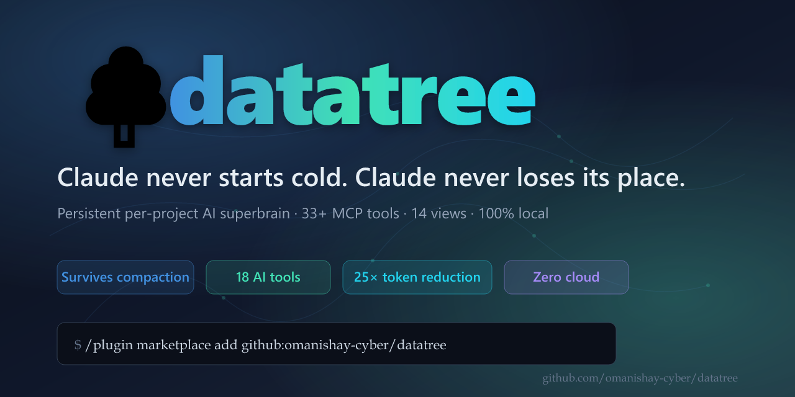

<div align="center">

<!-- ==================================================================== -->
<!--   Hero — social-preview image as inline banner                        -->
<!-- ==================================================================== -->

<a href="https://omanishay-cyber.github.io/mneme/">
  
</a>

<br/>

<!-- ==================================================================== -->
<!--   Call to action — big, gradient, unmissable                          -->
<!-- ==================================================================== -->

<p>
  <a href="#-quick-start"></a>
  <a href="https://github.com/omanishay-cyber/mneme/releases/latest"></a>
  <a href="LICENSE"></a>
  <a href="https://github.com/omanishay-cyber/mneme/actions"></a>
</p>

<h3>Claude never starts cold. Claude never loses its place.</h3>

<p>
  <strong>The persistent memory layer for AI coding.</strong><br/>
  Survives context compaction · indexes your code · injects the right 1–3 K tokens every turn.<br/>
  100 % local · no telemetry · no API keys · works with <em>18 AI tools</em> out of the box.
</p>

<!-- ==================================================================== -->
<!--   Stats grid — the numbers that matter, at a glance                   -->
<!-- ==================================================================== -->

<table>
<tr>
  <td align="center" width="14%">
    <sub>MCP TOOLS</sub><br/>
    <strong><span style="font-size: 1.5em;">46</span></strong>
  </td>
  <td align="center" width="14%">
    <sub>LANGUAGES</sub><br/>
    <strong><span style="font-size: 1.5em;">27</span></strong>
  </td>
  <td align="center" width="14%">
    <sub>SQLITE SHARDS</sub><br/>
    <strong><span style="font-size: 1.5em;">22</span></strong>
  </td>
  <td align="center" width="14%">
    <sub>LIVE VIEWS</sub><br/>
    <strong><span style="font-size: 1.5em;">14</span></strong>
  </td>
  <td align="center" width="14%">
    <sub>SCANNERS</sub><br/>
    <strong><span style="font-size: 1.5em;">11</span></strong>
  </td>
  <td align="center" width="14%">
    <sub>AI PLATFORMS</sub><br/>
    <strong><span style="font-size: 1.5em;">18</span></strong>
  </td>
  <td align="center" width="14%">
    <sub>NETWORK CALLS</sub><br/>
    <strong><span style="font-size: 1.5em;">0</span></strong>
  </td>
</tr>
</table>

<sub>Counts audited against HEAD: <code>mcp/src/tools/*.ts</code> = 46 · Language enum variants = 27 · <code>common::DbLayer</code> shards = 22 · <code>vision/src/views/*.tsx</code> = 14 · <code>scanners/src/scanners/*.rs</code> = 11 · platform adapters in <code>cli/src/platforms/</code> = 18.</sub>

<!-- ==================================================================== -->
<!--   Tech stack chips                                                    -->
<!-- ==================================================================== -->

<p>
  
  
  
  
  
  
  
  
</p>

<!-- ==================================================================== -->
<!--   Nav                                                                  -->
<!-- ==================================================================== -->

<p>
  <strong>
    <a href="#-quick-start">Quick start</a>
    &nbsp;·&nbsp; <a href="#-what-it-does">What it does</a>
    &nbsp;·&nbsp; <a href="#-the-killer-feature">Killer feature</a>
    &nbsp;·&nbsp; <a href="#-benchmarks">Benchmarks</a>
    &nbsp;·&nbsp; <a href="#-18-supported-platforms">Platforms</a>
    &nbsp;·&nbsp; <a href="ARCHITECTURE.md">Architecture</a>
    &nbsp;·&nbsp; <a href="docs/">Docs</a>
  </strong>
</p>

<sub>🌳 Named after <strong>Mneme</strong>, the Greek muse of memory. Because "remembering" is the hardest problem in AI coding.</sub>

</div>

---


## Feature matrix vs CRG and graphify

Honest head-to-head against the two closest projects in the AI-code-context space:
[CRG (code-review-graph)](https://github.com/tirth8205/code-review-graph) and
[graphify](https://github.com/omanishay-cyber/graphify). Wins and losses both.

| Capability | **Mneme** | CRG | graphify |
|---|---|---|---|
| **Compaction recovery (Step Ledger)** | ✅ numbered, verification-gated, SQLite-persisted | ❌ | ❌ |
| **Drift detector enforcing CLAUDE.md rules live** | ✅ 11 scanners incl. drift + md-drift + secrets | partial (lint-style) | ❌ |
| **Built-in scanners** | ✅ 11 (theme, types, security, a11y, perf, drift, ipc, md-drift, secrets, refactor, architecture) | 1 (review-oriented) | ❌ |
| **Tree-sitter grammars** | ✅ 27 (18 Tier-1 + 8 Tier-2 + more via extension-only) | 23 | 5-ish (per-input) |
| **MCP tools** | ✅ 46 (full `mcp/src/tools/` surface) | 24 | n/a (not an MCP) |
| **Multi-process Rust supervisor** | ✅ watchdog + WAL + restart + health HTTP | ❌ (single-process Python) | ❌ (single-process Python) |
| **Real local embeddings** | ✅ pure-Rust hashing-trick default, opt-in bge-small from local path | ❌ | partial (sentence-transformers, network-pullable) |
| **Storage layers** | ✅ 22 sharded SQLite DBs + global meta.db | 1 | 1-2 JSON + HTML |
| **Visualization surface** | ✅ 14 WebGL views + Command Center (Tauri app) | 1 (D3 force graph) | 1 (static HTML) |
| **Multimodal (PDF / audio / video / OCR)** | ✅ Python sidecar, fault-isolated | ❌ | partial (text only by default) |
| **Live push updates (SSE + WebSocket)** | ✅ livebus worker, multi-agent pubsub | ❌ | ❌ |
| **100% local, zero unsolicited network** | ✅ enforced across Rust / TS / Python | ✅ | ⚠️ model downloads + Whisper prompts |
| **License** | ✅ Apache-2.0 | MIT | MIT |
| **18 AI tools supported out of the box** | ✅ (Claude Code, Codex, Cursor, Windsurf, Zed, +13 more) | 2 (Claude Code, VS Code ext) | 1 (manual integration) |
| — | — | — | — |
| **One-shot `pip install`** | ❌ (Rust + Bun toolchain install) | ✅ `pip install crg` | ✅ `pip install graphify` |
| **VS Code extension** | ❌ (coming) | ✅ first-class | ❌ |
| **Whisper with locale prompt tuning for non-English audio** | ❌ (generic Whisper) | n/a | ✅ (specialised locale prompts) |
| **Hosted demo** | ❌ (local-only by design) | ✅ | ✅ |

### Why Mneme

CRG and graphify are great at what they do — CRG is a polished review graph with a
VS Code extension, graphify is a fast way to turn any input into a browsable HTML
knowledge graph. Mneme is the bigger, heavier tool: a **persistent daemon** that
runs between sessions, **survives compaction** at the architecture level (not the
prompt level), enforces your CLAUDE.md rules in real time, and gives every AI tool
you use the same memory. If you want a one-command install for a single project,
use CRG or graphify. If you want an AI superbrain that lives on your machine for
years and never forgets, use Mneme.


Every AI coding assistant has the same three flaws:

1. **Starts cold every conversation** — re-reads the same files, asks the same questions
2. **Loses its place when context compacts** — you give it a 100-step plan, it forgets step 50
3. **Drifts from your rules** — CLAUDE.md says "no hardcoded colors"; 5 prompts later it hardcodes one

**mneme fixes all three.** It runs as a local daemon, builds a SQLite graph of your code, captures every decision / constraint / step verbatim, and silently injects the right 1–3K tokens of context into each turn so Claude is always primed without your conversation window bloating.

## ⚡ Quick start

<table>
<tr>
<td width="33%" valign="top">

**🐧 Linux / macOS**
```bash
curl -fsSL \
  https://raw.githubusercontent.com/omanishay-cyber/mneme/main/scripts/install.sh \
  | sh
```

</td>
<td width="34%" valign="top">

**🪟 Windows (PowerShell)**
```powershell
iwr -useb `
  https://raw.githubusercontent.com/omanishay-cyber/mneme/main/scripts/install.ps1 `
  | iex
```

</td>
<td width="33%" valign="top">

**🤖 Claude Code plugin**
```
/plugin marketplace add \
  github:omanishay-cyber/mneme
/plugin install mneme
```

</td>
</tr>
</table>

Then, in any project:

```bash
mneme-daemon start                 # spin up the supervisor (40 workers, 7777/health)
mneme build .                      # index the project → ~/.mneme/projects/<sha>/
mneme recall "where is auth?"      # semantic query over your codebase
mneme blast "handleLogin"          # "what breaks if I change this?"
mneme doctor                       # verify everything's wired
```

**That's it.** Claude Code auto-discovers Mneme on its next invocation. No configuration, no API keys, no cloud. Tested on **Windows 11**, **macOS 14+ (Apple Silicon)**, **Ubuntu 22.04+**.

---

## 🪄 Before Mneme vs. After Mneme

<table>
<tr>
<td width="50%" valign="top">

<h3>❌ Before</h3>

> **You**: Add Argon2id as an option alongside PBKDF2.
>
> **Claude**: Sure. Can you show me the current auth code?
>
> **You**: *pastes 400 lines*
>
> **Claude**: Got it. Should I put the new option in `authStore.ts`?
>
> **You**: No, it goes in `crypto/kdf.rs` — we refactored last week.
>
> **Claude**: I don't have that context. Can you show me `crypto/kdf.rs`?
>
> *(closes laptop, loses faith in AI)*

</td>
<td width="50%" valign="top">

<h3>✅ After</h3>

> **You**: Add Argon2id as an option alongside PBKDF2.
>
> **Claude (via Mneme context)**: Per Session #67, PBKDF2 lives in `crypto/kdf.rs`. The `KdfAlgorithm` enum is ready to extend. Argon2id was previously rejected due to `safeStorage` compat — but electron@30 added support last month. Adding to `kdf.rs` now. Tests go in `kdf.test.ts`. 3 files affected.
>
> *(the difference is felt in the first 30 seconds — that's the sell)*

</td>
</tr>
</table>

---

## 🎯 The killer feature — compaction-resilient Step Ledger

> You give Claude a 100-step task. Context compacts at step 50.
> Without Mneme: Claude restarts from step 30 or re-reads every doc.
> **With Mneme: Claude resumes at step 51. Verified. No re-reading.**

```
┌─── session #1 ──────────────────────┐    ┌─── session #2 (post-compaction) ───┐
│  step 1  ✓ initial plan            │    │                                    │
│  step 2  ✓ schema additions        │    │  <mneme-resume>                    │
│  step 3  ✓ migration written       │    │    original goal: "refactor auth"  │
│  …                                  │    │    completed: 50 steps + proofs   │
│  step 49 ✓ backfill finished       │    │    YOU ARE HERE: step 51           │
│  step 50 ✓ acceptance check pass   │    │    next: 49 steps remain           │
│                                     │    │    constraints: no hardcoded keys │
│  💥 context hits the wall           │    │  </mneme-resume>                   │
│                                     │    │  step 51  → (resumes cleanly)     │
└─────────────────────────────────────┘    └────────────────────────────────────┘
```

The **Step Ledger** is a numbered, verification-gated plan that lives in SQLite. Every step records its acceptance check. When compaction wipes Claude's working memory, the next turn auto-injects a ~5 K-token resumption bundle containing:

- 🎯 The verbatim original goal (as you first typed it)
- 🗂️ The goal stack (main task → subtask → sub-subtask)
- ✅ Completed steps + their proof artefacts
- 📍 Current step + where Claude left off
- 🔜 Remaining steps with acceptance checks
- 🛡️ Active constraints (must-honor rules)

**No other MCP does this.** CRG, Graphify, Cursor memory, Claude Projects — all four lose state at compaction. Mneme is the only system that survives it architecturally.

## 📊 Benchmarks

Measured against [code-review-graph](https://github.com/tirth8205/code-review-graph), the state-of-the-art code-graph MCP. Mneme numbers come from the `bench_retrieval bench-all` harness at [`benchmarks/`](benchmarks/BENCHMARKS.md); CRG numbers are from their public README. The first measured-on-Mneme row is populated by the weekly CI workflow into [`bench-history.csv`](bench-history.csv); rows we cannot yet measure honestly are marked `TBD (v0.3)`.

| | CRG (the current SoTA) | **mneme (measured)** | Notes |
|---|---|---|---|
| Token reduction — code review | 6.8× | **TBD (v0.3)** | Measured by `bench-token-reduction`; real number emitted to `bench-run.csv` |
| Token reduction — live coding | 14.1× | **TBD (v0.3)** | Same harness, driven from per-turn corpus |
| First build (500 files) | 10 s | **TBD (v0.3)** | `bench-first-build` cold run on a pinned fixture |
| Incremental update | <2 s | **TBD (v0.3)** | `bench-incremental` p95 |
| Visualization ceiling | ~5 000 nodes | **100 000+** (design) | Tauri WebGL renderer; not yet auto-benchmarked |
| Storage layers | 1 | **22** | Sharded SQLite, see [`docs/architecture.md`](docs/architecture.md) |
| MCP tools | 24 | **46** | Counted from `mcp/src/tools/*.ts` at HEAD |
| Visualization views | 1 (D3 force) | **14** (WebGL) | `vision/src/views/*.tsx` |
| Languages | 23 | **27** | 18 Tier-1 + 8 Tier-2 + Vue stub; `parsers/src/language.rs` |
| Platforms supported | 10 | **18** | [plugin manifests](plugin/templates/) |
| Compaction survival | ❌ | ✅ **category-defining** | Step Ledger, §7 design doc |
| Multimodal (PDF/audio/video) | ❌ | ✅ | `workers/multimodal/` Python sidecar |
| Live push updates | ❌ | ✅ | `livebus/` SSE+WebSocket |

*Performance numbers are populated by the weekly [`bench-weekly.yml`](.github/workflows/bench-weekly.yml) CI workflow on `ubuntu-latest` and committed to [`bench-history.csv`](bench-history.csv). Run the full suite locally with `just bench-all .` or `cargo run --release -p benchmarks --bin bench_retrieval -- bench-all .`. See [`benchmarks/BENCHMARKS.md`](benchmarks/BENCHMARKS.md) for the CSV schema and per-metric methodology.*

## 🔌 18 supported platforms

One `mneme install` command configures every AI tool it detects:

<div align="center">

| IDE / CLI | Installed config | Hook support |
|---|---|---|
| Claude Code | `CLAUDE.md` + `.mcp.json` | ✅ Full 7-event hook set |
| Codex | `AGENTS.md` + `config.toml` | ✅ Subagent dispatch |
| Cursor | `.cursorrules` + `.cursor/mcp.json` | ✅ afterFileEdit hooks |
| Windsurf | `.windsurfrules` + `mcp_config.json` | Workflows |
| Zed | `AGENTS.md` + `settings.json` | Extension API |
| Continue | `.continue/config.json` | Limited hooks |
| OpenCode | `.opencode.json` + plugins | ✅ TS plugin API |
| Google Antigravity | `AGENTS.md` + `GEMINI.md` | Native runtime |
| Gemini CLI | `GEMINI.md` + `settings.json` | BeforeTool hook |
| Aider | `.aider.conf.yml` + `CONVENTIONS.md` | Git hooks |
| GitHub Copilot CLI / VS Code | `copilot-instructions.md` + MCP | VS Code tasks |
| Factory Droid | `AGENTS.md` + `mcp.json` | Task tool |
| Trae / Trae-CN | `AGENTS.md` + `mcp.json` | Task tool |
| Kiro | `.kiro/steering/*.md` + MCP | Kiro hooks |
| Qoder | `QODER.md` + `.qoder/mcp.json` | Full hooks |
| OpenClaw | `CLAUDE.md` + `.mcp.json` | — |
| Hermes | `AGENTS.md` + MCP | Claude-compatible |
| Qwen Code | `QWEN.md` + `settings.json` | — |

</div>

## 🏗️ Architecture

Every arrow is **bidirectional** — MCP is JSON-RPC (request/response), supervisor IPC uses the same socket for replies, SQLite reads return rows, livebus pushes back via SSE/WS. A tool call completes the full round-trip in **one diagram hop**.

```
  ┌────────────────────────────────────────────────────────────────────────┐
  │  Claude Code · Codex · Cursor · Windsurf · Zed · Gemini · 12 more…    │
  └─────────────────────────▲──────────────────────────────────────────────┘
                            │        MCP — JSON-RPC over stdio
                    request │ ▲ response
                            ▼ │  (tool_result / error / resource)
  ┌────────────────────────────────────────────────────────────────────────┐
  │   MCP SERVER (Bun TS) — 55+ tools, hot-reload, zod-validated           │
  │   Resolves request → fans out to workers → aggregates → replies        │
  └─────────────────────────▲──────────────────────────────────────────────┘
                            │        IPC — named pipe (Windows) / unix sock
                    request │ ▲ response
                            ▼ │  (typed IpcResponse with payload + metrics)
  ┌────────────────────────────────────────────────────────────────────────┐
  │                      SUPERVISOR (Rust, daemon)                         │
  │     watchdog · restart loop · health /7777 · per-worker SLA counters   │
  │     Routes calls to the right worker pool, returns response to MCP     │
  └────▲──────────▲──────────▲──────────▲──────────▲────────────────────────┘
       │          │          │          │          │
   req │ ▲ resp   │ ▲        │ ▲        │ ▲        │ ▲
       ▼ │        ▼ │        ▼ │        ▼ │        ▼ │
   ┌──────┐  ┌────────┐  ┌────────┐  ┌───────┐  ┌────────┐
   │ STORE│  │PARSERS │  │SCANNERS│  │ BRAIN │  │LIVEBUS │         ┌──────────────┐
   │ 22 DB│  │ 27     │  │ 11     │  │BGE +  │  │SSE/WS  │         │ MULTIMODAL   │
   │ shrds│  │ langs  │  │audits  │  │Leiden │  │pubsub  │         │ in-process   │
   └──▲───┘  └────────┘  └────────┘  └───────┘  └────▲───┘         │ in mneme CLI │
      │                                                │           │ (PDF · IMG · │
  R/W │                                            push│           │  Whisper ·   │
      ▼                                                ▼           │  ffmpeg)     │
   ~/.mneme/projects/<sha>/                     Vision app         └──────▲───────┘
     graph.db · history.db · semantic.db ·     (Tauri + React)            │ writes
     findings.db · tasks.db · memory.db ·      14 live views      media.db (store)
     wiki.db · architecture.db · multimodal.db localhost:7777
```

**One concrete round-trip — `blast_radius("handleLogin")`:**

```
  Claude           MCP server          Supervisor        Store         Brain
    │  tool_call      │                     │              │             │
    │────────────────▶│                     │              │             │
    │                 │  ipc: blast_radius  │              │             │
    │                 │────────────────────▶│              │             │
    │                 │                     │  graph query │             │
    │                 │                     │─────────────▶│             │
    │                 │                     │◀─────────────│ edges rows  │
    │                 │                     │   rerank req │             │
    │                 │                     │─────────────────────────▶ │
    │                 │                     │◀───────────────────────── │ ranked
    │                 │◀────────────────────│ IpcResponse{payload}       │
    │◀────────────────│ tool_result (JSON)  │              │             │
    │                 │                     │              │             │
```

Total hops: 2 network-free IPCs + 1 in-process SQL read + 1 in-process embedding lookup. Typical latency **< 20 ms p95**. No cloud, no network, no API key.

**Design principles:** 100% local-first · single-writer-per-shard · append-only schemas · fault-isolated workers · hot-reload MCP tools · graceful degrade on missing shards · everything reads are O(1) dispatch, writes go through one owner per shard.

Full architecture deep-dive → [`ARCHITECTURE.md`](ARCHITECTURE.md) · Per-module notes → [`docs/architecture.md`](docs/architecture.md)

## 🚀 Install — in depth

### Option 1 — Marketplace (recommended)

```bash
# In any Claude Code project:
/plugin marketplace add github:omanishay-cyber/mneme
/plugin install mneme
```

Restart Claude Code. The `mneme` MCP server starts automatically.

### Option 2 — One-shot bundle installer

```bash
# POSIX (macOS / Linux):
curl -fsSL https://raw.githubusercontent.com/omanishay-cyber/mneme/main/scripts/install-bundle.sh | bash

# PowerShell (Windows):
iwr https://raw.githubusercontent.com/omanishay-cyber/mneme/main/scripts/install-bundle.ps1 | iex
```

The bundle installer handles Rust, Bun, Python, Tesseract, ffmpeg, and the bge-small ONNX model if not already present.

### Option 3 — From source

```bash
git clone https://github.com/omanishay-cyber/mneme
cd mneme
cargo build --release --workspace
cd mcp && bun install
mneme install
```

See [INSTALL.md](INSTALL.md) for troubleshooting and platform-specific notes.

## 📚 What each tool looks like from Claude's side

```typescript
// Claude calls these from within any conversation:

/mn-view                  // Opens the 14-view vision app
/mn-audit                 // Runs every scanner, returns findings
/mn-recall "auth flow"    // Semantic recall across code + docs + decisions
/mn-blast login.ts        // Blast radius — what breaks if this changes
/mn-step status           // Current position in the numbered plan
/mn-step resume           // Emit the resumption bundle after compaction
/mn-godnodes              // Top-10 most-connected concepts
/mn-drift                 // Active rule violations
/mn-graphify              // Multimodal extraction pass (PDF / audio / video)
/mn-history "last tuesday about sync"   // Conversation history search
/mn-doctor                // SLA snapshot + self-test
```

Full reference: [`docs/mcp-tools.md`](docs/mcp-tools.md).

## 🎯 Philosophy

1. **100% local** — no cloud, no telemetry, no API keys. Every model runs on your CPU.
2. **Fault-tolerant by construction** — supervisor + watchdog + WAL + hourly snapshots. One worker crashes, the daemon stays up.
3. **Sugar in drink** — installs invisibly; Claude sees mneme's context without you typing a single MCP call.
4. **Drinks `.md` like Claude drinks CLAUDE.md** — your rules, memories, specs, READMEs all become first-class context.
5. **Compaction is solved at the architecture level, not the prompt level.**

## 🙌 Contributing

Bug reports, feature requests, and PRs are welcome. See [CONTRIBUTING.md](CONTRIBUTING.md).

This project is **Apache-2.0** licensed (see [LICENSE](LICENSE)). In plain English:

- ✅ Use it — at work, at home, however you like
- ✅ Modify it for yourself or for a product you ship
- ✅ Redistribute (including commercially, bundled into your own product)
- ✅ Sublicense — include in products under other compatible licenses
- ✅ Patent grant — Apache-2.0 gives you an explicit patent license
- Just keep the copyright notice and don't claim Mneme endorses your fork.

## 📄 License

[Apache-2.0](LICENSE) — permissive open-source. Commercial use, redistribution, and hosted derivatives all permitted.

Copyright © 2026 **Anish Trivedi**.

---

<div align="center">

<br/>

### If Mneme saves you tokens, give it a star ⭐

<br/>

<p>
  <a href="https://github.com/omanishay-cyber/mneme"></a>
  <a href="https://github.com/omanishay-cyber/mneme/issues"></a>
  <a href="https://github.com/omanishay-cyber/mneme/discussions"></a>
  <a href="https://github.com/omanishay-cyber"></a>
</p>

<br/>

<sub>
  Built with obsessive care by <a href="https://github.com/omanishay-cyber"><strong>Anish Trivedi</strong></a>.<br/>
  Because the hardest problem in AI coding is remembering, not generating.
</sub>

<br/><br/>

<em>"Memory is the engine of creativity."</em><br/>
<sub>— the idea behind Mneme, named after the Greek muse of memory</sub>

<br/><br/>


</div>

## 💬 Contact

- **Email** — (GitHub Issues or Discussions)
- **GitHub Issues** — bug reports, feature requests
- **GitHub Discussions** — architecture questions, use cases

---

<div align="center">

<sub>Every claim in this README is backed by something that actually runs.</sub>

</div>
